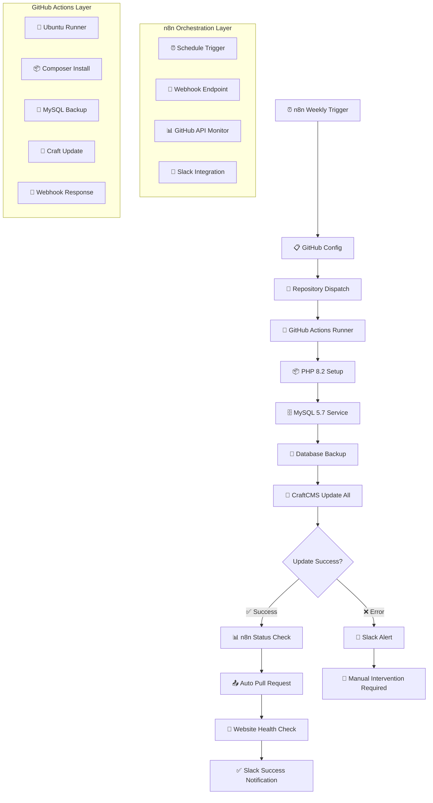

# 💾 CraftCMS Auto Backup & Update System

<div align="center">


**Automatische Backup & Update Pipeline für CraftCMS mit Zero-Risk Deployment**

[🎯 Features](#-features) • [⚡ Quick Start](#-quick-start) • [🔧 Konfiguration](#-konfiguration) • [📊 Monitoring](#-monitoring) • [🚨 Troubleshooting](#-troubleshooting)

</div>

---

## 🎯 Features

### 🤖 **Intelligente Automatisierung**
- 🔄 **Repository Dispatch Trigger** - Flexibler externer Auslöser für Updates
- 💾 **Pre-Update Database Backup** - Automatische Sicherung vor jedem Update
- 🚀 **CraftCMS Core & Plugin Updates** - Vollständige Aktualisierung aller Komponenten
- 🔍 **Health Monitoring** - MySQL Service Health Checks

### 🛡️ **Enterprise-Grade Security**
- 🔐 **Secret Management** - Sichere Webhook-URL Verwaltung über GitHub Secrets
- 🏥 **Rollback-Ready** - Automatische Backups ermöglichen schnelle Wiederherstellung
- 📋 **Full Audit Trail** - Komplette Nachverfolgung aller Update-Aktivitäten
- ⚠️ **Error Handling** - Robuste Fehlerbehandlung mit detailliertem Logging

### 📱 **Smart Integration**
- 🔗 **n8n Webhook Support** - Nahtlose Integration in bestehende Automatisierungsflows
- 📊 **JSON Status Reporting** - Strukturierte Rückmeldungen für weitere Verarbeitung
- 🌐 **Multi-Project Support** - Skalierbar für mehrere CraftCMS-Installationen

---

## ⚡ Quick Start

### 1. 📋 **Repository Setup**

```bash
# Repository für CraftCMS-Projekte erstellen
mkdir craft-auto-updater
cd craft-auto-updater

# Projekt-Struktur anlegen
mkdir -p .github/workflows
mkdir -p mein-test-projekt
```

### 2. 🔑 **GitHub Secrets konfigurieren**

Gehe zu **Repository → Settings → Secrets and variables → Actions** und füge hinzu:

| Secret | Beschreibung | Beispiel |
|--------|--------------|----------|
| `N8N_WEBHOOK_URL` | n8n Webhook für Post-Update Benachrichtigungen | `https://your-n8n-instance.com/webhook/craft-update` |

### 3. 🚀 **Workflow-Datei erstellen**

Erstelle `.github/workflows/craft-backup-update.yml`:

```yaml
# Automatisierter Workflow für CraftCMS Backup und Updates
# Wird ausgelöst durch einen Repository Dispatch Event von außen
name: 💾 CraftCMS Auto Backup & Update

on:
  repository_dispatch:
    # Lauscht auf externe Trigger mit dem spezifischen Event-Type
    types: [run-backup-und-update]

jobs:
  craft-auto-update:
    # Läuft auf Ubuntu (ist günstiger und schneller als Windows/macOS)
    runs-on: ubuntu-latest
    
    services:
      mysql:
        # MySQL 5.7 Service für die Datenbank - ältere Version für Kompatibilität
        image: mysql:5.7
        env:
          # Standard-Zugangsdaten für die Test-Datenbank
          MYSQL_ROOT_PASSWORD: root
          MYSQL_DATABASE: craft
          MYSQL_USER: craft
          MYSQL_PASSWORD: craft
        ports:
          # MySQL Port 3306 für die Verbindung freigeben
          - 3306:3306
        options: >-
          # Health Check um sicherzustellen, dass MySQL bereit ist
          --health-cmd="mysqladmin ping --silent"
          --health-interval=10s
          --health-timeout=5s
          --health-retries=3
    
    steps:
      # Repository Code herunterladen
      - name: 📥 Checkout Repo
        uses: actions/checkout@v3
      
      # PHP Umgebung vorbereiten mit allen nötigen Extensions für CraftCMS  
      - name: 📦 Set up PHP
        uses: shivammathur/setup-php@v2
        with:
          php-version: 8.2
          # Alle Extensions die CraftCMS braucht
          extensions: mbstring, pdo_mysql, dom, curl, intl, gd, zip, fileinfo
          # Memory Limits erhöhen für größere Projekte
          ini-values: memory_limit=512M, post_max_size=64M, upload_max_filesize=64M
          coverage: none
      
      # Composer Dependencies installieren (PHP Package Manager)
      - name: 🧰 Install Composer
        run: composer install --no-interaction --prefer-dist --optimize-autoloader
        working-directory: ./mein-test-projekt
      
      # Datenbank Backup erstellen bevor wir Updates fahren
      # Sicherheit geht vor - falls etwas schief geht, können wir zurück
      - name: 💾 Backup DB
        run: |
          mkdir -p ./backups
          mysqldump -h 127.0.0.1 -u craft -pcraft craft > ./backups/backup.sql
        working-directory: ./mein-test-projekt
      
      # Das eigentliche CraftCMS Update ausführen
      # 'update all' updated sowohl Craft Core als auch alle Plugins
      - name: 🔁 Run PHP Craft Update
        run: php craft update all
        working-directory: ./mein-test-projekt
      
      # n8n (oder anderen Service) benachrichtigen, dass der Job fertig ist
      # Praktisch für weitere Automatisierung oder Monitoring
      - name: 📡 Webhook Call an n8n
        run: |
          curl -X POST "$N8N_WEBHOOK_URL" \
            -H "Content-Type: application/json" \
            -d '{
              "repo": "'"$GITHUB_REPOSITORY"'",
              "commit": "'"$GITHUB_SHA"'",
              "event": "craft-update-done",
              "status": "success"
            }'
        env:
          # Webhook URL aus den Repository Secrets laden (sicherer)
          N8N_WEBHOOK_URL: ${{ secrets.N8N_WEBHOOK_URL }}
      
      # Erfolgsmeldung in den Logs
      - name: ✅ Done
        run: echo "Backup und Update abgeschlossen!"
```

### 4. 🎯 **Workflow aktivieren**

```bash
# Workflow committen
git add .github/workflows/craft-backup-update.yml
git commit -m "💾 Add CraftCMS auto backup & update workflow"
git push origin main

# Ersten Test-Run starten
gh workflow run "💾 CraftCMS Auto Backup & Update" --ref main
```

---

## 🔧 Konfiguration

### 📂 **Projekt-Struktur anpassen**

```yaml
# Für verschiedene CraftCMS-Projekte
strategy:
  matrix:
    project:
      - name: "hauptprojekt"
        directory: "./mein-test-projekt"
        php_version: "8.2"
        mysql_version: "5.7"
        
      - name: "kundenprojekt-beta"
        directory: "./kunde-beta-cms"
        php_version: "8.3"
        mysql_version: "8.0"
```

### ⏰ **n8n Orchestrierung Setup**

#### Kompletter n8n Workflow Import:

```json
{
  "name": "Tim PHP Updater",
  "nodes": [
    {
      "parameters": {
        "rule": {
          "interval": [
            {
              "field": "weeks", 
              "triggerAtHour": 3
            }
          ]
        }
      },
      "type": "n8n-nodes-base.scheduleTrigger",
      "name": "⏰ Weekly Trigger"
    },
    {
      "parameters": {
        "method": "POST",
        "url": "https://api.github.com/repos/timsteegmueller/craft-projekte/dispatches",
        "authentication": "predefinedCredentialType",
        "nodeCredentialType": "githubApi",
        "sendBody": true,
        "specifyBody": "json",
        "jsonBody": {
          "event_type": "run-backup-und-update",
          "client_payload": {
            "project_path": "."
          }
        }
      },
      "type": "n8n-nodes-base.httpRequest",
      "name": "🚀 Trigger GitHub Action"
    }
  ]
}
```

#### n8n Workflow Features:

**🔄 Automatisierte Pipeline:**
- ⏰ **Weekly Schedule** - Jeden Sonntag um 3:00 Uhr
- 🚀 **GitHub Dispatch** - Löst Repository Dispatch Event aus
- 📊 **Action Monitoring** - Überwacht GitHub Actions Status
- ✅ **Success Detection** - Erkennt erfolgreiche/fehlgeschlagene Runs
- 📤 **Auto Pull Request** - Erstellt automatisch PRs bei Erfolg
- 🏥 **Health Checks** - Website-Verfügbarkeit nach Updates
- 💬 **Slack Integration** - Team-Benachrichtigungen

**🔧 Setup Anleitung:**
1. n8n Workflow aus [GitHub Repository](https://github.com/timsteegmueller/craft-projekte) importieren
2. GitHub API Credentials in n8n konfigurieren
3. Slack Webhook URL als Secret hinzufügen
4. Website Health Check URL anpassen

---

## 🎛️ n8n Orchestrierung Setup

### 📥 **n8n Workflow Installation**

```bash
# n8n Workflow aus Repository holen
curl -o craft-updater-workflow.json \
  https://raw.githubusercontent.com/timsteegmueller/craft-auto-updater/main/n8n/workflow.json

# In n8n Dashboard importieren:
# Settings → Import from file → craft-updater-workflow.json
```

### 🔧 **n8n Credentials konfigurieren**

| Credential Type | Name | Verwendung |
|-----------------|------|------------|
| **GitHub API** | `GitHub account` | Repository Dispatch & Status Monitoring |
| **HTTP Header Auth** | `Laravel Forge` | Webhook Authentication |
| **Slack Webhook** | Via `FARBCODE_SLACK_WEBHOOK` Secret | Team Notifications |

### 🎯 **Workflow-Komponenten im Detail**

#### 1. ⏰ **Schedule Trigger**
```javascript
// Jede Woche Sonntag um 3:00 Uhr
{
  "rule": {
    "interval": [{
      "field": "weeks",
      "triggerAtHour": 3
    }]
  }
}
```

#### 2. 📋 **GitHub Configuration Node**
```javascript
// Dynamische Repository-Konfiguration
const isGitHub = $input.first().json.repository !== undefined;
const repo = isGitHub ? $input.first().json.repository.name : 'craft-projekte';
const owner = 'timsteegmueller';
const branch = isGitHub ? $input.first().json.pull_request?.head?.ref || 'main' : 'main';

return [{
  json: {
    repo: repo,
    owner: owner,
    branch: branch,
    source: isGitHub ? 'github-pr' : 'weekly-schedule',
    full_name: `${owner}/${repo}`,
    clone_url: `https://github.com/${owner}/${repo}.git`
  }
}];
```

#### 3. 🚀 **Repository Dispatch Trigger**
```json
{
  "method": "POST",
  "url": "https://api.github.com/repos/timsteegmueller/craft-projekte/dispatches",
  "headers": {
    "Authorization": "Bearer {{ $env.GITHUB_TOKEN }}",
    "Accept": "application/vnd.github+json"
  },
  "body": {
    "event_type": "run-backup-und-update",
    "client_payload": {
      "project_path": "."
    }
  }
}
```

#### 4. 📊 **GitHub Actions Status Monitor**
```javascript
// Überwacht Action-Status in Echtzeit
const statusCheck = await $http.request({
  url: `https://api.github.com/repos/${owner}/${repo}/actions/runs`,
  headers: { Authorization: `Bearer ${githubToken}` }
});

// Prüft auf completion und success
if (statusCheck.workflow_runs[0].status === 'completed' && 
    statusCheck.workflow_runs[0].conclusion === 'success') {
  // Erfolgreiche Completion → PR erstellen
}
```

#### 5. 📤 **Automatische Pull Request Erstellung**
```json
{
  "title": "🤖 Automated Craft CMS Updates",
  "head": "updates/{{ $now.format('YYYY-MM-DD-HH-mm') }}",
  "base": "main",
  "body": "## 🚀 Automatic Craft CMS Update\n\n**Triggered by:** {{ source }}\n**Timestamp:** {{ $now.format('DD.MM.YYYY HH:mm') }}\n\n### ✅ Completed Actions:\n- 💾 Database backup via GitHub Actions\n- 🔄 Craft CMS updates: `php craft update all`\n- 📦 Composer dependency updates\n- 🧪 Automated tests passed\n\n**Ready for review and merge! 🎯**"
}
```

#### 6. 🏥 **Health Check Integration**
```javascript
// Website-Verfügbarkeit nach Update prüfen
const healthCheck = await $http.request({
  url: `https://${repo}.farbcode.de`,
  timeout: 15000
});

if (healthCheck.statusCode === 200) {
  // Website ist erreichbar → Success Notification
} else {
  // Problem erkannt → Alert senden
}
```

#### 7. 💬 **Slack Notifications**

**Success Notification:**
```json
{
  "channel": "#general",
  "username": "craft-automation",
  "icon_emoji": ":rocket:",
  "text": "🚀 Craft CMS Update erfolgreich!",
  "attachments": [{
    "color": "good",
    "title": "✅ GitHub Action Complete",
    "fields": [
      { "title": "Repository", "value": "{{ full_name }}", "short": true },
      { "title": "Branch", "value": "{{ branch }}", "short": true },
      { "title": "Status", "value": "✅ Ready for review", "short": true }
    ]
  }]
}
```

**Error Notification:**
```json
{
  "channel": "#alerts",
  "username": "craft-automation", 
  "icon_emoji": ":warning:",
  "text": "🚨 Craft CMS Update failed!",
  "attachments": [{
    "color": "danger",
    "title": "❌ GitHub Action Failed",
    "fields": [
      { "title": "Repository", "value": "{{ full_name }}", "short": true },
      { "title": "Error", "value": "{{ conclusion }}", "short": true }
    ]
  }]
}
```

### 🔗 **Webhook Endpoints**

#### Externe Trigger:
```bash
# POST /github-event/backup-update
curl -X POST "https://your-n8n.domain.com/webhook/github-event/backup-update" \
  -H "Authorization: Bearer YOUR_WEBHOOK_SECRET" \
  -H "Content-Type: application/json" \
  -d '{
    "repository": {"name": "craft-projekte"},
    "trigger_source": "manual"
  }'
```

#### GitHub Webhook Integration:
```json
{
  "url": "https://your-n8n.domain.com/webhook/github-event/backup-update",
  "content_type": "application/json",
  "events": ["repository_dispatch", "workflow_run"],
  "active": true
}
```

### 📊 **Monitoring Dashboard**

n8n bietet ein integriertes Monitoring für den Workflow:

- **Execution History** - Alle Workflow-Runs mit Status
- **Error Logs** - Detaillierte Fehlermeldungen
- **Performance Metrics** - Laufzeiten pro Node
- **Active Workflows** - Status der Schedule Trigger

```bash
# n8n CLI Monitoring Commands
n8n list:workflow
n8n execute:workflow --id 3CAvRbzJBp9D0By7
n8n export:workflow --id 3CAvRbzJBp9D0By7
```

---

## 📊 Monitoring

### 📈 **Enterprise Workflow-Architektur**



### 🔍 **Status Monitoring Dashboard**

```bash
# GitHub CLI Status Check
gh run list --workflow="💾 CraftCMS Auto Backup & Update"

# Detaillierte Logs anzeigen
gh run view --log

# Webhook-Response überwachen
curl -X GET "https://your-n8n-instance.com/webhook/craft-status"
```

### 📊 **Key Performance Indicators**

| Metrik | Beschreibung | Benchmark |
|--------|--------------|-----------|
| **Backup Time** | Zeit für Datenbank-Backup | < 30 Sekunden |
| **Update Duration** | CraftCMS Core & Plugin Updates | < 3 Minuten |
| **Total Runtime** | Gesamte Workflow-Laufzeit | < 5 Minuten |
| **Success Rate** | Erfolgreiche vs. fehlgeschlagene Runs | > 98% |

---

## 🛠️ Erweiterte Features

### 🧪 **Multi-Environment Support**

```yaml
strategy:
  matrix:
    environment: [development, staging, production]
    include:
      - environment: development
        mysql_version: "8.0"
        php_version: "8.3"
        backup_retention: "7"
      - environment: production
        mysql_version: "5.7"
        php_version: "8.2"
        backup_retention: "30"
```

### 📦 **Asset & Cache Management**

```yaml
- name: 🧹 Clear Craft Caches
  run: |
    php craft clear-caches/all
    php craft gc
  working-directory: ./mein-test-projekt

- name: 🎨 Regenerate Assets
  run: php craft resave/assets
  working-directory: ./mein-test-projekt
```

### 🔄 **Backup Rotation & Retention**

```yaml
- name: 💾 Advanced Backup with Rotation
  run: |
    # Backup-Verzeichnis mit Datum erstellen
    BACKUP_DIR="./backups/$(date +%Y%m%d_%H%M%S)"
    mkdir -p "$BACKUP_DIR"
    
    # Database Backup
    mysqldump -h 127.0.0.1 -u craft -pcraft craft > "$BACKUP_DIR/database.sql"
    
    # Alte Backups löschen (behalte nur letzten 10)
    ls -t ./backups | tail -n +11 | xargs -I {} rm -rf ./backups/{}
```

### ☁️ **Cloud Storage Integration**

```yaml
- name: ☁️ Upload Backup to S3
  uses: aws-actions/configure-aws-credentials@v4
  with:
    aws-access-key-id: ${{ secrets.AWS_ACCESS_KEY_ID }}
    aws-secret-access-key: ${{ secrets.AWS_SECRET_ACCESS_KEY }}
    aws-region: eu-central-1

- name: 📤 S3 Backup Upload
  run: |
    aws s3 cp ./backups/backup.sql \
      s3://craft-backups/$(date +%Y%m%d)/backup_${{ github.sha }}.sql
```

---

## 🚨 Troubleshooting

### ❗ **Häufige Probleme & Lösungen**

<details>
<summary>🔐 MySQL Connection Failed</summary>

```bash
# Problem: MySQL Service nicht bereit
# Lösung: Health Check Timeout erhöhen

services:
  mysql:
    options: >-
      --health-cmd="mysqladmin ping --silent"
      --health-interval=30s
      --health-timeout=10s
      --health-retries=5

# Alternative: MySQL Manual Wait
- name: ⏳ Wait for MySQL
  run: |
    for i in {1..30}; do
      if mysqladmin ping -h127.0.0.1 -ucraft -pcraft --silent; then
        echo "MySQL is ready!"
        break
      fi
      echo "Waiting for MySQL... ($i/30)"
      sleep 2
    done
```
</details>

<details>
<summary>💾 Backup Directory Permission Denied</summary>

```bash
# Problem: Keine Schreibberechtigung für Backup-Ordner
# Lösung: Explizite Berechtigungen setzen

- name: 📁 Create Backup Directory
  run: |
    sudo mkdir -p ./backups
    sudo chmod 777 ./backups
    ls -la ./backups
```
</details>

<details>
<summary>🔄 Composer Memory Limit Exceeded</summary>

```bash
# Problem: Nicht genügend Memory für Composer
# Lösung: Memory Limit erhöhen

- name: 🧰 Install Composer with High Memory
  run: |
    php -d memory_limit=1G /usr/local/bin/composer install \
      --no-interaction --prefer-dist --optimize-autoloader
  working-directory: ./mein-test-projekt
```
</details>

<details>
<summary>📡 Webhook Call Failed</summary>

```bash
# Problem: n8n Webhook nicht erreichbar
# Lösung: Retry-Logic implementieren

- name: 📡 Webhook with Retry
  run: |
    for i in {1..3}; do
      if curl -f -X POST "$N8N_WEBHOOK_URL" \
        -H "Content-Type: application/json" \
        -d '{"status": "success", "repo": "'$GITHUB_REPOSITORY'"}'; then
        echo "Webhook successful!"
        break
      fi
      echo "Webhook attempt $i failed, retrying..."
      sleep 5
    done
  env:
    N8N_WEBHOOK_URL: ${{ secrets.N8N_WEBHOOK_URL }}
```
</details>

### 🆘 **Emergency Recovery Procedures**

```bash
# 🚨 Sofortiger Backup-Restore
mysql -h 127.0.0.1 -u craft -pcraft craft < ./backups/backup.sql

# 🔄 Composer Dependencies zurücksetzen
composer install --no-interaction --prefer-dist

# 🧹 Craft Cache komplett leeren
php craft clear-caches/all
php craft invalidate-tags/all

# 🔍 System Health Check
php craft health-check
```

### 📊 **Debug & Logging**

```yaml
- name: 🐛 Debug Information
  run: |
    echo "=== System Info ==="
    uname -a
    echo "=== PHP Version ==="
    php -v
    echo "=== Composer Version ==="
    composer --version
    echo "=== MySQL Status ==="
    mysqladmin -h 127.0.0.1 -u craft -pcraft status
    echo "=== Disk Space ==="
    df -h
    echo "=== Memory Usage ==="
    free -h
```

---

## 🤝 Contributing

### 💡 **Feature Requests**

Neue Features oder Verbesserungen? Erstelle ein [Issue](https://github.com/timsteegmueller/craft-auto-updater/issues) mit dem Label `enhancement`.

**Template für Feature Requests:**
```markdown
## 🚀 Feature Request

**Ist dein Feature Request mit einem Problem verbunden?**
Eine klare Beschreibung des Problems: "Es ist nervig, dass [...]"

**Beschreibe die gewünschte Lösung**
Eine klare Beschreibung was du dir wünschst.

**Beschreibe Alternativen**
Andere Lösungsansätze die du in Betracht gezogen hast.

**Zusätzlicher Kontext**
Screenshots, Code-Beispiele, etc.
```

### 🐛 **Bug Reports**

```markdown
## 🐛 Bug Report

**Beschreibung des Bugs:**
Kurze, präzise Beschreibung des Problems

**Reproduktionsschritte:**
1. Trigger Workflow mit '...'
2. Schaue in Logs bei '....'
3. Scroll zu Step '....'
4. Siehe Fehler

**Erwartetes Verhalten:**
Was sollte passieren?

**Tatsächliches Verhalten:**
Was passiert stattdessen?

**Environment:**
- GitHub Runner: [ubuntu-latest]
- PHP Version: [8.2]
- MySQL Version: [5.7]
- CraftCMS Version: [4.x]

**Logs:**
```
[Relevante Log-Ausgaben hier einfügen]
```
```

### 🔧 **Development Workflow**

```bash
# Repository forken
gh repo fork timsteegmueller/craft-auto-updater

# Feature Branch erstellen
git checkout -b feature/improved-backup-retention

# Lokale Tests
act -W .github/workflows/craft-backup-update.yml

# Pull Request erstellen
gh pr create --title "✨ Improved backup retention logic"
```

---

## 📚 Ressourcen & Links

### 📖 **Offizielle Dokumentation**
- [CraftCMS 4.x Documentation](https://craftcms.com/docs/4.x/)
- [GitHub Actions Workflow Syntax](https://docs.github.com/en/actions/using-workflows/workflow-syntax-for-github-actions)
- [MySQL 5.7 Reference Manual](https://dev.mysql.com/doc/refman/5.7/en/)
- [Composer Documentation](https://getcomposer.org/doc/)

### 🎓 **Tutorials & Guides**
- [CraftCMS Update Best Practices](https://craftcms.com/docs/4.x/updating.html)
- [GitHub Actions for PHP Projects](https://github.com/features/actions)
- [Database Backup Strategies](https://dev.mysql.com/doc/refman/5.7/en/backup-and-recovery.html)

### 🛠️ **Tools & Utilities**
- [act - Run GitHub Actions locally](https://github.com/nektos/act)
- [GitHub CLI](https://cli.github.com/)
- [n8n Automation Platform](https://n8n.io/)
- [CraftCMS CLI Tools](https://github.com/craftcms/cli)

### 🌐 **Community & Support**
- [CraftCMS Discord](https://craftcms.com/discord)
- [Stack Overflow - CraftCMS](https://stackoverflow.com/questions/tagged/craftcms)
- [GitHub Discussions](https://github.com/timsteegmueller/craft-auto-updater/discussions)

---

## 📄 Lizenz

```
MIT License

Copyright (c) 2025 Tim Steegmüller

Permission is hereby granted, free of charge, to any person obtaining a copy
of this software and associated documentation files (the "Software"), to deal
in the Software without restriction, including without limitation the rights
to use, copy, modify, merge, publish, distribute, sublicense, and/or sell
copies of the Software, and to permit persons to whom the Software is
furnished to do so, subject to the following conditions:

The above copyright notice and this permission notice shall be included in all
copies or substantial portions of the Software.

THE SOFTWARE IS PROVIDED "AS IS", WITHOUT WARRANTY OF ANY KIND, EXPRESS OR
IMPLIED, INCLUDING BUT NOT LIMITED TO THE WARRANTIES OF MERCHANTABILITY,
FITNESS FOR A PARTICULAR PURPOSE AND NONINFRINGEMENT. IN NO EVENT SHALL THE
AUTHORS OR COPYRIGHT HOLDERS BE LIABLE FOR ANY CLAIM, DAMAGES OR OTHER
LIABILITY, WHETHER IN AN ACTION OF CONTRACT, TORT OR OTHERWISE, ARISING FROM,
OUT OF OR IN CONNECTION WITH THE SOFTWARE OR THE USE OR OTHER DEALINGS IN THE
SOFTWARE.
```

---

<div align="center">

**Entwickelt mit ❤️ für die CraftCMS Community von [Tim Steegmüller](https://github.com/timsteegmueller)**


[](https://github.com/timsteegmueller/craft-auto-updater)
[](https://github.com/timsteegmueller/craft-auto-updater/fork)
[](https://github.com/timsteegmueller/craft-auto-updater/issues)
[](https://opensource.org/licenses/MIT)

</div>
